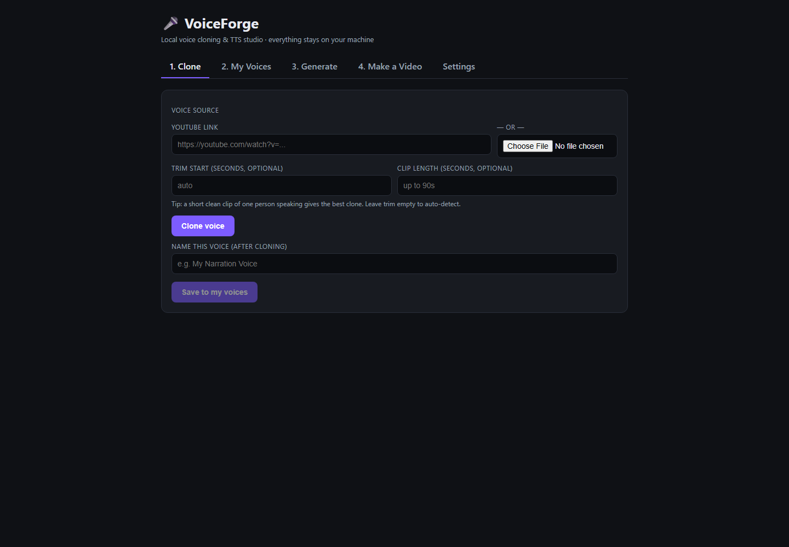

# VoiceForge

VoiceForge is a local voice-cloning, text-to-speech, and talking-video studio powered by the [Venice AI API](https://docs.venice.ai/). Each user supplies their own Venice API key, which is stored in the operating-system credential vault—not in project files.



## Features

- Clone voices from a YouTube link or uploaded audio/video
- Save unlimited named voice handles locally
- Generate downloadable MP3 narration
- Create cinematic narrated videos from a photo
- Optional local Wav2Lip lip-sync and GFPGAN face restoration
- Backend-observed video stages, progress, cancellation, and automatic temporary-media expiry
- Local-only server at `127.0.0.1:8765`; no telemetry

## Responsible use

Only clone voices with the speaker's informed permission. Do not use VoiceForge for impersonation, fraud, harassment, or deception. Disclose synthetic media where appropriate and comply with applicable law and platform terms.

## Requirements

- Python 3.10–3.12
- [ffmpeg and ffprobe](https://ffmpeg.org/download.html) on `PATH`
- A Venice API key with credits: <https://venice.ai/settings/api>
- Git only for optional lip-sync setup

## Windows quick start

1. Download or clone this repository.
2. Install Python and ffmpeg.
3. Double-click `install.bat` once.
4. Double-click `run.bat`.
5. Open <http://127.0.0.1:8765>, choose **Settings**, and save your Venice API key.
6. Optional: double-click `create-shortcut.bat` to add a Desktop launcher.

## macOS/Linux

```sh
chmod +x install.sh run.sh
./install.sh
./run.sh
```

## Optional lip-sync

Wav2Lip is **not distributed by this MIT repository**. Its upstream code/model has separate personal/research/non-commercial terms. Core cloning, TTS, and cinematic video work without it. Read [docs/optional-lipsync.md](docs/optional-lipsync.md).

## Privacy

- The server binds only to loopback and is not designed for LAN/public exposure.
- The API key is stored through `keyring` in Windows Credential Manager, macOS Keychain, or a supported Linux Secret Service.
- Saved names and Venice handles live in ignored `data/voices.json`.
- Uploaded media is processed in temporary directories and deleted after each request.
- Media/text is sent to Venice only when needed for the requested API operation.
- Use YouTube downloads only for content you own or may download.

## Privacy and deletion

See [docs/privacy-architecture.md](docs/privacy-architecture.md) for the exact local and network data flow. Deleting a saved voice removes only the local VoiceForge record; upstream Venice deletion must be handled through Venice. Completed asynchronous video files expire locally after 30 minutes.

## Troubleshooting

If startup reports that port 8765 is occupied, close the other local service or stale VoiceForge process and retry. See [docs/troubleshooting.md](docs/troubleshooting.md).

## Development

```sh
python -m venv .venv
python -m pip install -r requirements/dev.txt
pytest -q
python scripts/verify_release.py
```

See [SECURITY.md](SECURITY.md), [CONTRIBUTING.md](CONTRIBUTING.md), [CHANGELOG.md](CHANGELOG.md), and [NOTICE.md](NOTICE.md).

## License

VoiceForge-owned source is MIT licensed. Optional third-party software and weights retain their own terms and are not covered by VoiceForge's MIT license.
